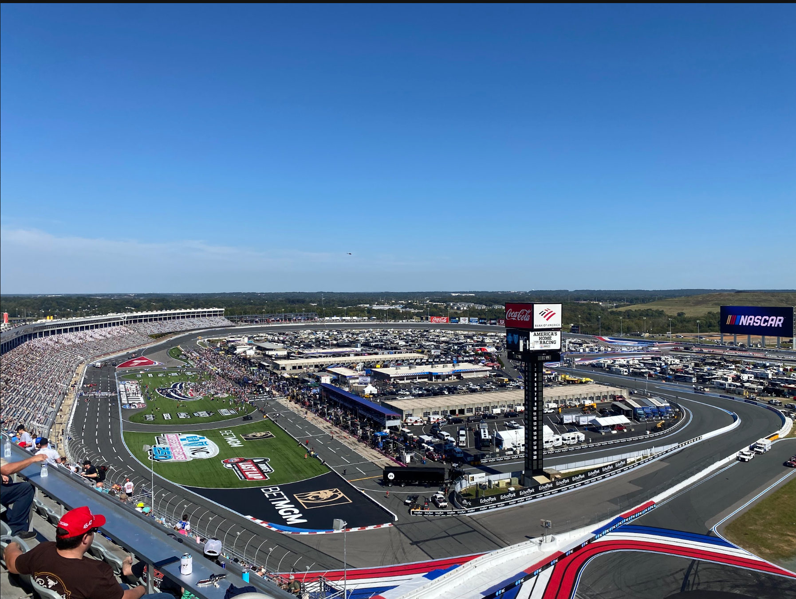

#About Me

I'm Noah Nicholson, originally from Massachusetts 45 mins from Boston. I loved racing from an early age in video games but I as I started watching motorsports I became quickly intrigued about how it all work. After all how hard can driving something as fast as possible be? I learned through broadcasts that most of the speed came not from the drive but from the engineers that build them. From there I learned through Iracing Simulations and NASCAR broadcasting that building racing setups was a balancing act of optimization to achieve the best competitive results. Noticing patterns in cross-weight in a race car and how to manipulate it to best suit a driver or track. The further I get into my degree, the more I realize that every aspect of engineering is at play and I learn to understand how all my classes at UNC Charlotte contribute and develop my understanding of mechanical engineering.
