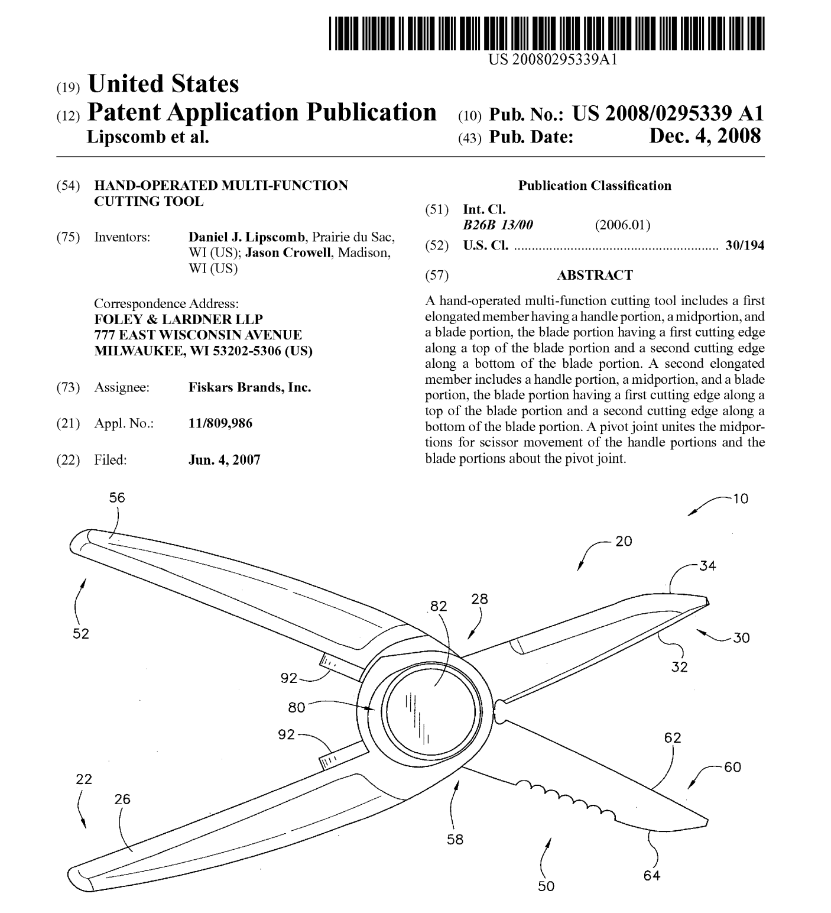
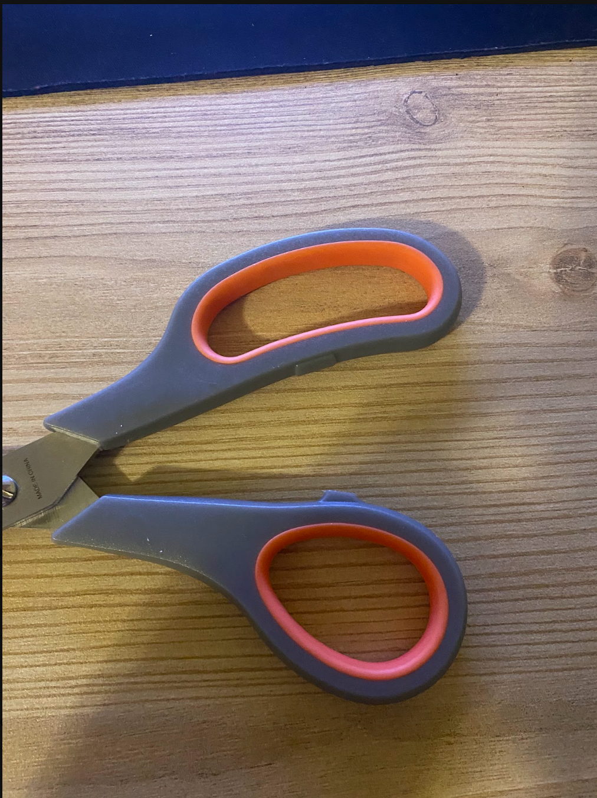
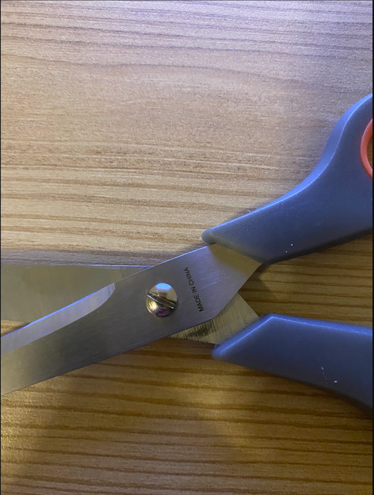
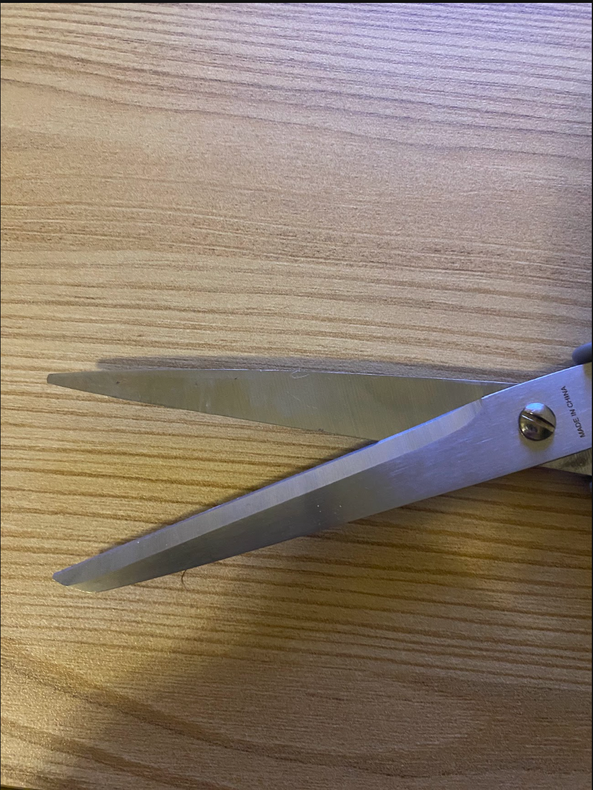

# A1 – Building Your Professional Portfolio

## Objective
Analyze: Identify the governing model, state its assumptions, and apply it to the right problem.

Decide: Make a choice between alternatives, document your criteria, and justify your selection.

Communicate: Present your reasoning so clearly that a colleague can reproduce your work without asking you a single question.

## Analyze
# Portfolio Analysis 1: [Lao Thomorn](https://myportfolio-7s0.pages.dev/)

Navigability: Yes, I was able to clearly locate and access the author's projects easily and well within 60 seconds.

Reproductivity: Most projects were final products that were posted as previews of the author's abilities; the author described what the project was and/or how to operate them. However unless the project was through github, it would be difficult to recreate them given the information provided.

Evidence of Reasoning: Projects contained the purpose for which they were created however they did not contain any evidence for how or why the author chose the specific product that they completed.

Professional Tone: The author is to the point and does not use any unneeded information. Clear and professional/respectful tone throughout.

# Portfolio Analysis 2: [narasimha67](https://narasimha67-mech.github.io/Narasimha_cad_portfilio/)

Navigability: Easily able to access the author's projects within one minute and they are clearly labeled.

Reproductivity: The projects are easy to identify and described well, however the process in which they were made is unclear and not possible to follow.

Evidence of Reasoning: Author provided descriptions of the projects and the goals that were targeted and met. However the reasoning behind the choices made to achieve those is absent from the portfolio.

Professional Tone: The author used a respectful, however some sentences are structured similarly to bullet points and are not complete sentences.

# Product Analysis:

A. The function of this product is to generate a shear force by creating two opposing forces that will create a fracture along the area in which the forces were applied.

B. A pair of scissors (amazon Basics Multipurpose Stainless Steel Scissors) uses steel blades (2), Plastic grips (2), and a pin (1) to hold the blades together. The model uses steel to create the shear force, this is reasonable due to the comparison between the moment of elasticity between steel and the materials that the scissors would be used to shear.

C. 

The grip is designed to provide a surface for the user's fingers to rest on while also providing enough freedom to move the fingers in the motion required to generate the shear force needed to fracture a desired object. Additionally it provided protection from the steel blades underneath the grips.

The pin serves the purpose of interlocking the two blades and locking the blades movements to be symmetrical to the other. This ensures that the blades will always work parallel to each other in order to create a perfect shear fracture on a desired object.

## Decide

## Communicate

