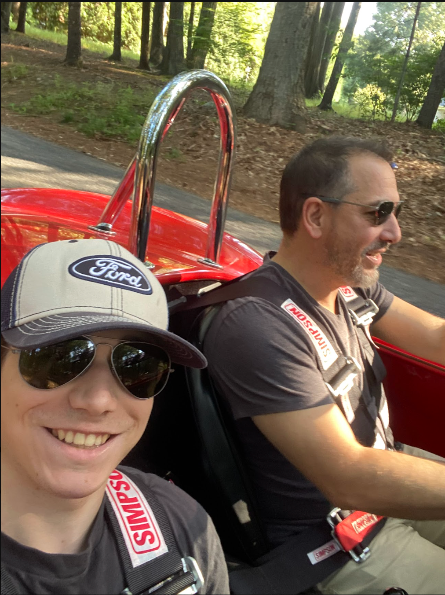
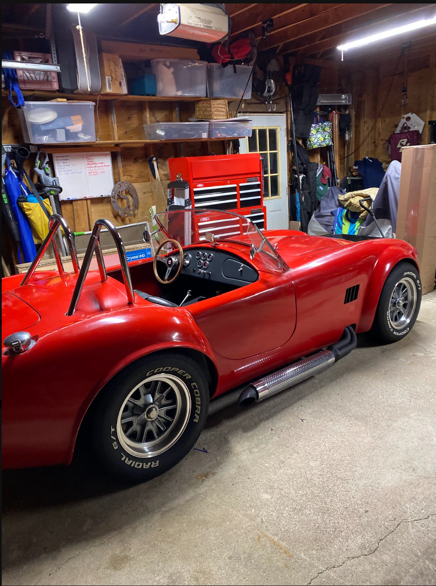

# Noah Nicholson – Design Portfolio

  
  

I am Noah Nicholson, a third year mechanical engineering student with a concentration in motorsports. This portfolio will detail my past and latest steps in my career as a mechanical engineer. Additionally, I will showcase my abilities to design, understand, and document my models and designs giving an insight into how I approach and solve a variety of situations in the most effective and efficient manner possible.

> **Engineering is the art of making decisions you can defend.**

## The three pillars

Most assignment pages are organized around:

- **Analyze** — the calculations, models, and data behind your design.
- **Decide** — the choice you made and, critically, the reasoning for it.
- **Communicate** — the drawings, report, and presentation you'd hand to a client.

Use the navigation on the left to move between assignments.

## Semester arc

- **Act I (Weeks 1–7):** Building vocabulary through the bracket sequence.
- **Act II (Weeks 8–11):** Surveying the machine-element landscape and formally comparing options.
- **Act III (Weeks 12–15):** Building the complete lead screw translating system.

By A11, every design decision you defend should trace back to something you analyzed and communicated earlier in this site.
